4# GameStack - Gaming E-Commerce Website

Welcome to **GameStack**, an interactive and modern e-commerce website for purchasing game CDs. GameStack offers an immersive user experience with stunning visuals, responsive design, and robust functionality.

---

## 🚀 Features

### Core Features:
1. **Responsive Design:**
   - Fully responsive layout compatible with desktops, tablets, and mobile devices using Bootstrap's grid system.

2. **Product Display:**
   - Displays game products with their images, names, and categories.

3. **Add to Cart:**
   - Easily add games to the cart from the product list.

4. **Category Filter:**
   - Filter games by categories (Action, RPG, Adventure, etc.) for quick navigation.

5. **Search Feature:**
   - Search for specific games by name.

6. **Cart Features:**
   - View all items in the cart.
   - Remove games from the cart.
   - Shows the total price dynamically.

### Additional Features:
1. **Hover Effects:**
   - Attractive hover animations for buttons and product cards.

2. **Game Description:**
   - Detailed descriptions for each game to help users make informed purchases.

3. **Dynamic Discounts:**
   - Display original and discounted prices along with the percentage of discounts.

4. **Interactive Carousel:**
   - A Bootstrap carousel showcasing featured games or offers.

5. **Footer Links:**
   - Social media links and footer navigation for improved accessibility.

---

## 🛠️ Technologies Used

- **HTML5** for structure
- **CSS3** for styling
- **JavaScript** for interactivity
- **Bootstrap** for responsiveness and pre-designed components

---

## 💻 Setup Instructions

1. **Clone the Repository:**
   ```bash
   git clone https://github.com/your-username/GameStack.git
   ```

2. **Navigate to the Project Folder:**
   ```bash
   cd GameStack
   ```

3. **Open the Project:**
   Open `index.html` in your browser.

---

## 🖼️Screenshots

**Desktop**

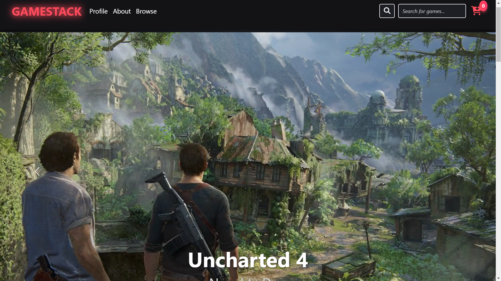
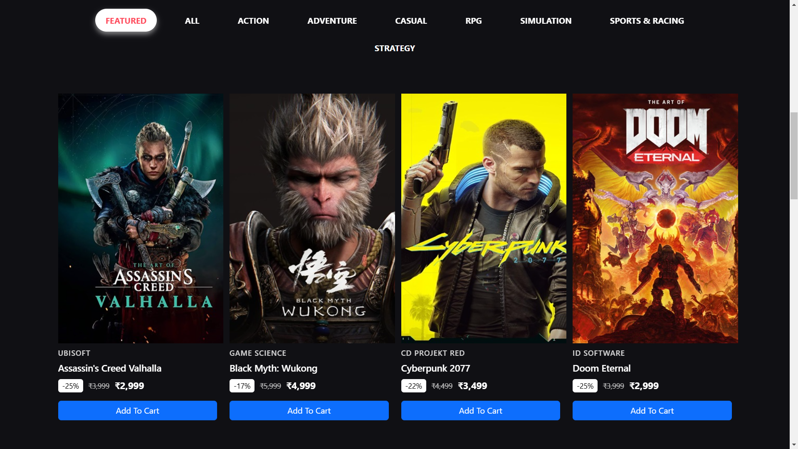
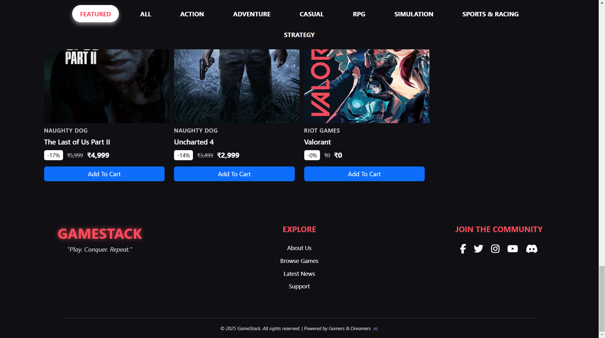
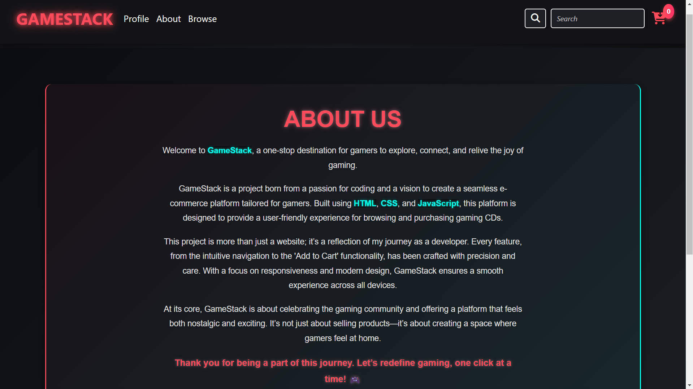
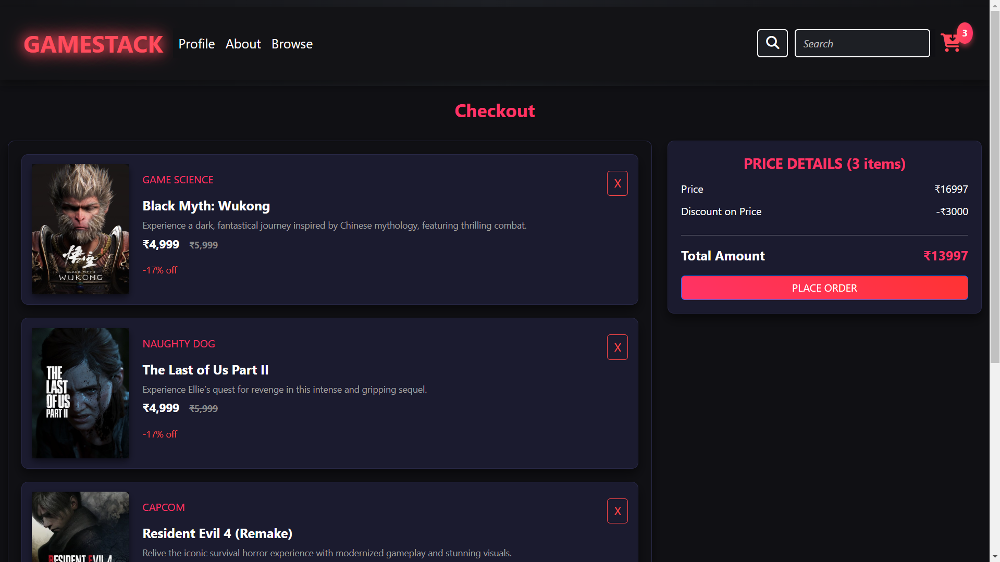
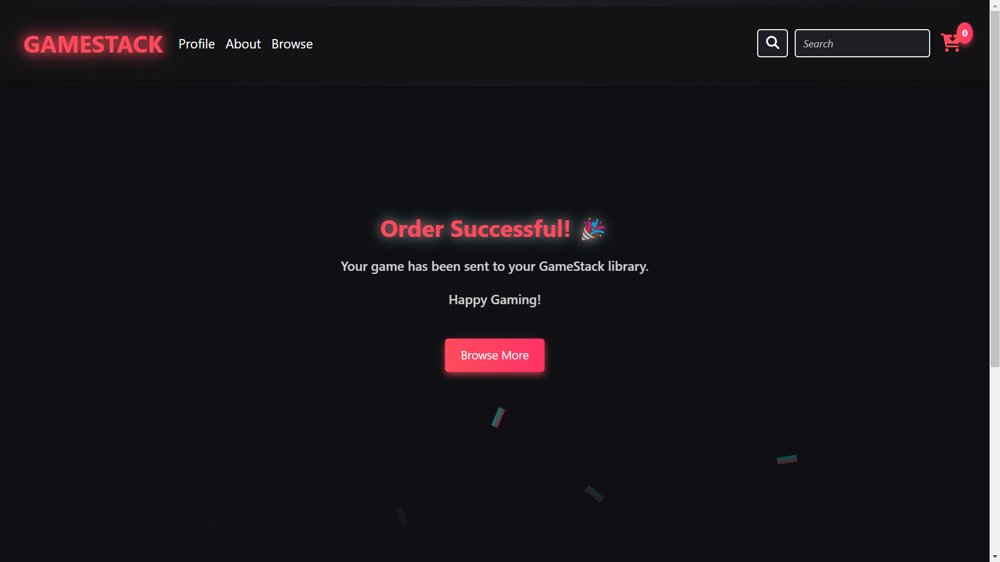


**Mobile**

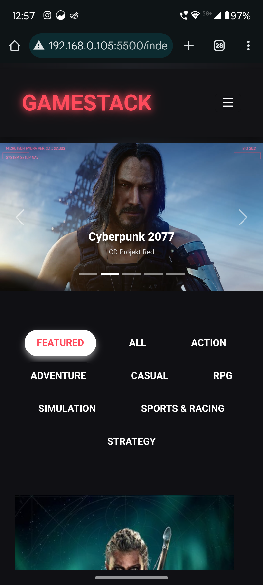
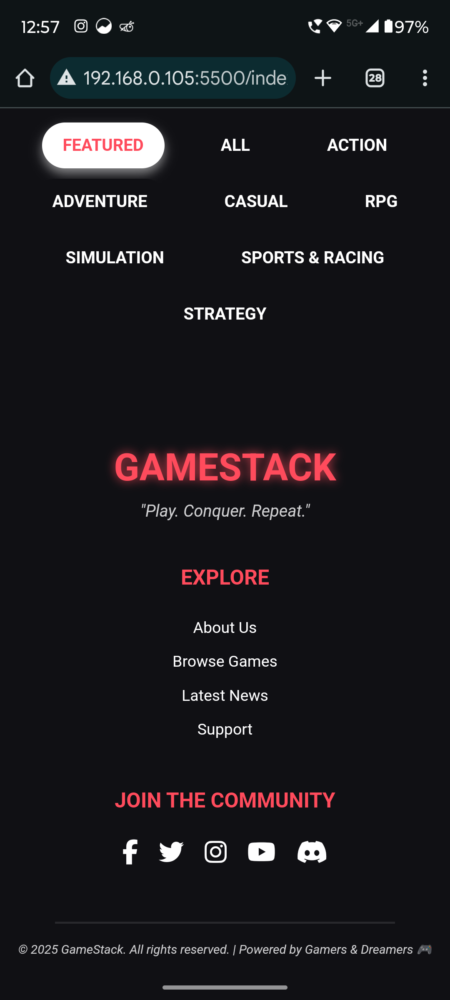
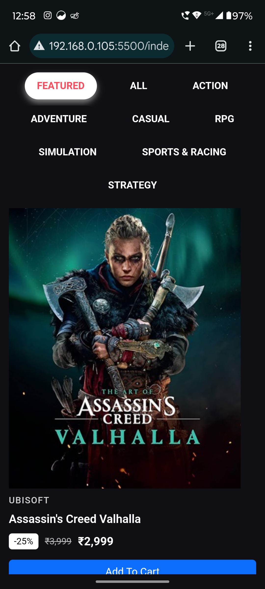
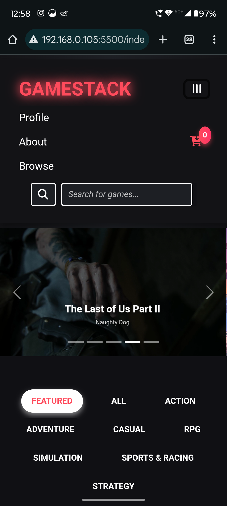
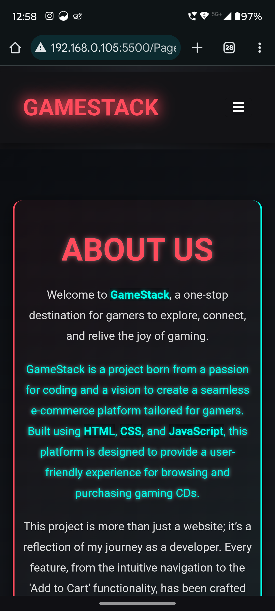
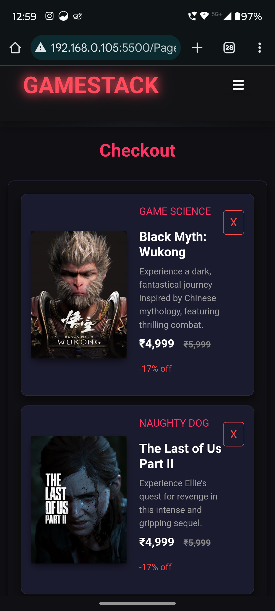
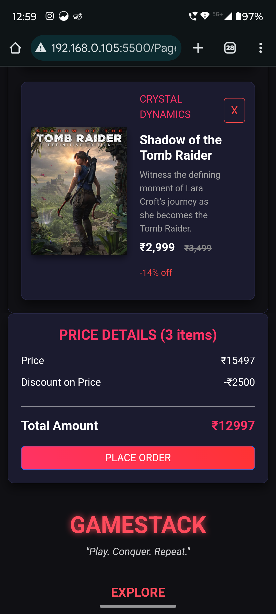
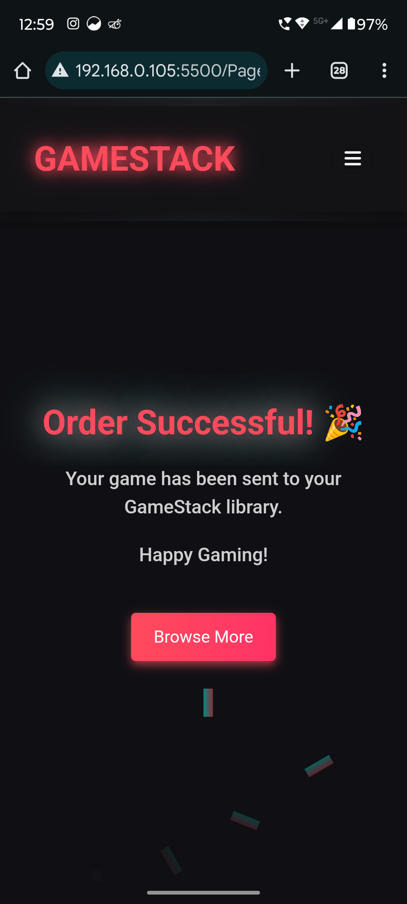
